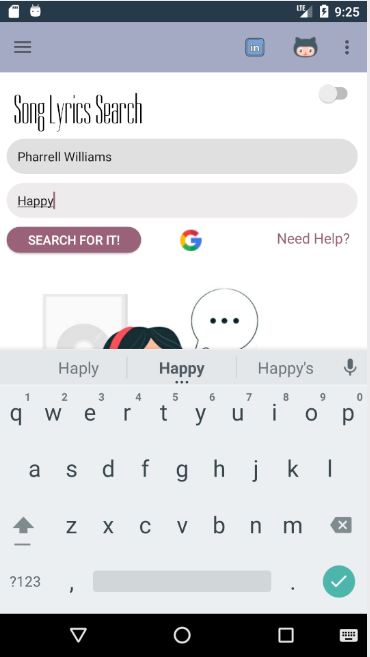
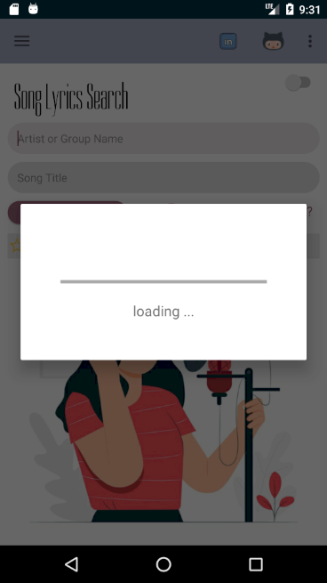
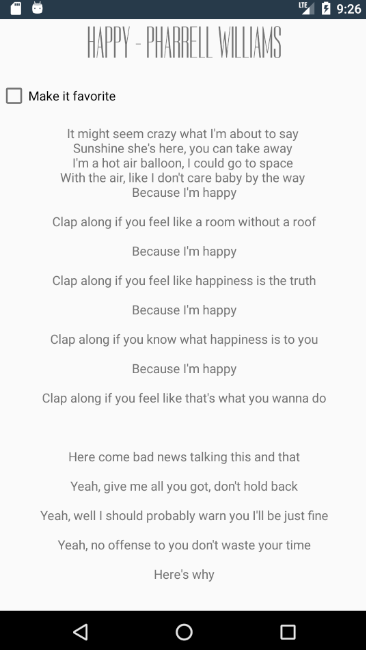
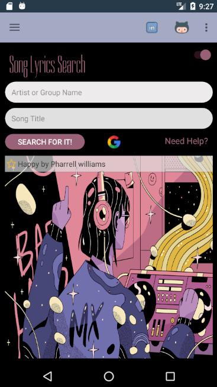
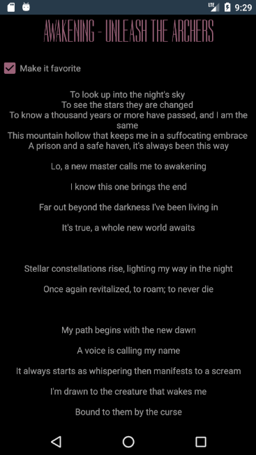
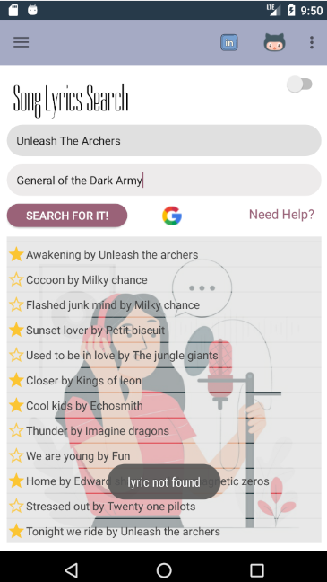
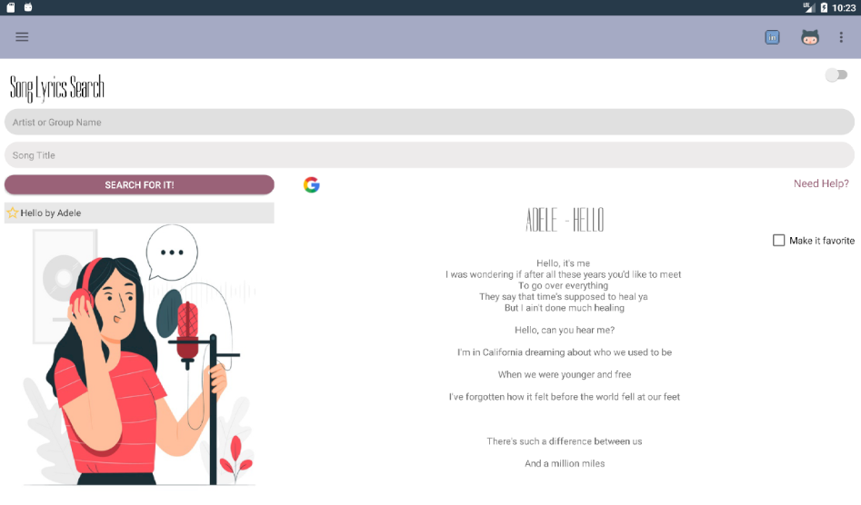

# Song Lyrics Search Application for Android
by **Andressa Machado**

## Description
Song Lyrics Search is an application developed in order to learn more about Android development. Althoug the general idea of 
the application is very simple, a great number of mobile development features was implemented. 

The application's name already gave us the idea for what it was developed for. User can type in an artist or group's name, followed 
by the title of one of their songs and the API will retrieve the lyric.

`When user searches for a song, it shows the lyric retrieved from the API and save it to the database. Every song searched by the user
is displayed in a ListView so the user can select a previously searched song and have access to the lyric quickly.`

- [x] Animated Splash Screen

- [x] Application is adapted to tablets and bigger screens by using a fragment.

- [x] English and Portuguese supported

- [x] SharedPreferences let the user decide which layout style is better

- [x] SQLiteDatabase used to save songs previously searched

- [x] Bundle and Intent used to move data between activities and fragment

- [x] User Input Validation

and more...

## API 
For the development of this application the lyrics.ovh API was used. You can check more about it [here](https://lyricsovh.docs.apiary.io/#) .

## Android version 
Application was developed using `Android SDK 6.0 API 23 Marshmallow`.

## Running the Application
An APK was generated and added to this repository, you can find it following this path [Song-Lyrics-Search-Application/app/release/app-release.apk](https://github.com/andressamachado/Song-Lyrics-Search-Application/blob/master/app/release/app-release.apk)
, but please, be aware that this application was developed under API 23 and some functions could not run properly in some devices with 
higher API.

You can always clone the project, and using Android Studio, run the application using an Android Virtual Device (AVD) with API 23.

## Screenshots - app running on a phone
There are more screenshots under [Song-Lyrics-Search-Application/screenshots/](https://github.com/andressamachado/Song-Lyrics-Search-Application/tree/master/screenshots)

    
   

## Screenshots - app running on a tablet
There are more screenshots under [Song-Lyrics-Search-Application/screenshots/](https://github.com/andressamachado/Song-Lyrics-Search-Application/tree/master/screenshots)

## Contact 
I can be reached at pess0005@algonquinlive.com, andressa.pamachado@gmail.com or via my [LinkedIn](https://www.linkedin.com/in/andressa-machado-59705792/) page.

Any feedback is always welcome as I am building my skills and they are more than valuable. 

Thank you for having taken the time to see my android application :smiling_face_with_three_hearts:
